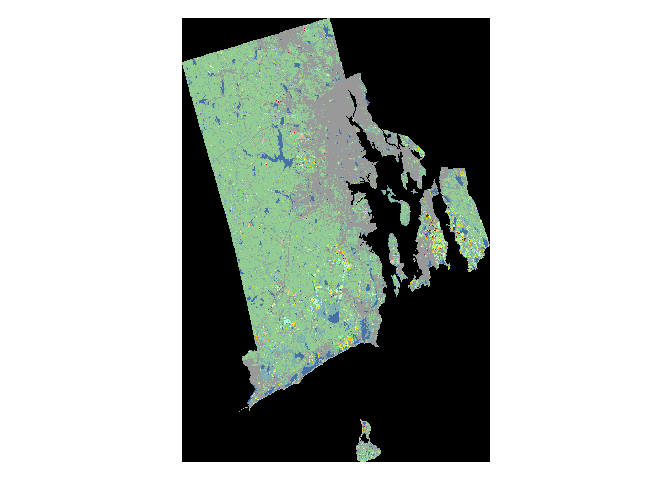

<!-- README.md is generated from README.Rmd. Please edit that file -->
cdlTools [](http://www.r-pkg.org/pkg/cdlTools)
===============================================================================================

[](http://www.r-pkg.org/pkg/cdlTools)

Tools to Download and Work with USDA Cropscape Data
---------------------------------------------------

    #>      Information on package 'cdlTools'
    #> 
    #> Description:
    #> 
    #> Package:       cdlTools
    #> Title:         Tools to Download and Work with USDA Cropscape Data
    #> Version:       0.13
    #> Date:          2017-09-14
    #> Author:        Lu Chen and Jonathan Lisic
    #> Maintainer:    Jonathan Lisic <jlisic@gmail.com>
    #> Description:   Downloads USDA National Agricultural Statistics
    #>                Service (NASS) cropscape data for a specified
    #>                state. Utilities for fips, abbreviation, and name
    #>                conversion are also provided. Full functionality
    #>                requires an internet connection, but data sets can
    #>                be cached for later off-line use.
    #> License:       Unlimited
    #> LazyData:      true
    #> Imports:       RCurl, raster, utils, httr
    #> RoxygenNote:   6.0.1
    #> Built:         R 3.4.3; x86_64-pc-linux-gnu; 2018-02-09 19:05:59
    #>                UTC; unix
    #> 
    #> Index:
    #> 
    #> census2010FIPS          U.S. Census 2010 FIPS Data
    #> corn                    CDL corn classes
    #> cotton                  CDL cotton classes
    #> cultivated              CDL cultivated classes
    #> durumWheat              CDL durum wheat classes
    #> fips                    FIPS code conversion function.
    #> getCDL                  Get CDL raster data
    #> matchCount              Counts distinct pixel pairs in CDL raster
    #>                         images
    #> nothing                 CDL nothing class
    #> pasture                 CDL pasture classes
    #> projCDL                 The default projection of CDL data
    #> soybeans                CDL soybeans classes
    #> springWheat             CDL spring wheat classes
    #> stateNames              U.S. Census 2010 State FIPS Data
    #> updateNamesCDL          Label CDL classes.
    #> varNamesCDL             Enumerated CDL classes
    #> water                   CDL water classes
    #> winterWheat             CDL winter wheat classes

``` r
library(cdlTools)
library(raster)
#> Loading required package: sp

ri <- getCDL("RI", 2015, ssl.verifypeer = FALSE)

plot(ri$RI2015)
```


